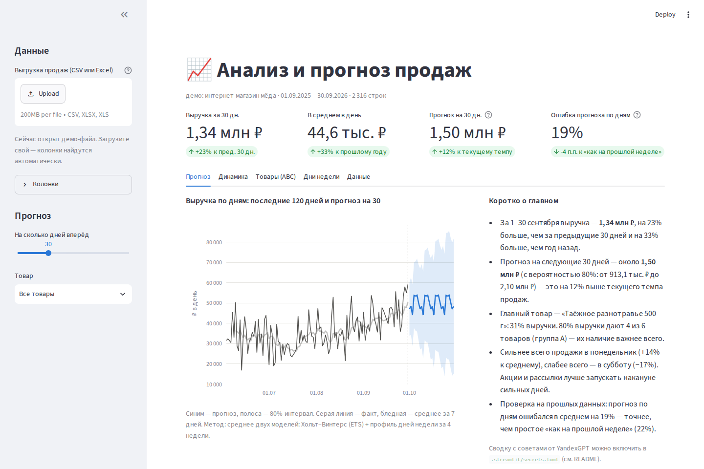

# Анализ и прогноз продаж · Sales analytics & forecast (Streamlit)

🇷🇺 [Русский](#русский) · 🇬🇧 [English](#english)



---

## Русский

Веб-приложение для владельца малого бизнеса. Загружаете выгрузку продаж и сразу видите: сколько заработали и как это соотносится с прошлым месяцем и прошлым годом, какие товары делают выручку, в какие дни недели продажи сильнее и сколько ждать в следующие 7–90 дней. Внизу — короткая сводка обычным языком.

**Что внутри**

- 📂 **Любая выгрузка:** CSV или Excel из 1С, МойСклад, маркетплейса или кассы. Понимает `;` и `,`, кодировку Windows-1251, суммы вида `1 234,50 ₽` и даты `01.03.2026`. Колонки с датой, суммой, товаром и количеством находятся сами; если нет — выбираются в меню.
- 📈 **Прогноз на 7–90 дней** по всем товарам или по одному, с интервалом 80% для каждого дня и для суммы за период. Прогноз можно скачать в CSV.
- ✅ **Честная проверка точности:** модель «прогнозирует» уже прошедшие периоды, и ошибка сравнивается с простым правилом «как на прошлой неделе».
- 🅰️ **ABC-анализ:** какие товары дают 80% выручки (их всегда держать в наличии), а какие — кандидаты на вывод.
- 📅 **Динамика по месяцам и дни недели:** когда запускать акции и рассылки.
- 📝 **Сводка «коротко о главном»** с цифрами. По кнопке — советы от YandexGPT (по желанию).

**Модель.** Прогноз — среднее двух простых моделей: Хольт–Винтерс (ETS) с недельной сезонностью быстро ловит текущий уровень продаж, а профиль дней недели за последние 4 недели не даёт одному странному дню увести прогноз. Модель выбрана по проверке на демо-данных (8 прошлых окон по 30 и 14 дней, общая выручка и 6 товаров):

| Ошибка по дням (WAPE), 30 дней | |
|---|---|
| «Как на прошлой неделе» | 45,9% |
| Только Хольт–Винтерс | 39,3% |
| Только профиль 4 недель | 37,9% |
| **Среднее двух (используется)** | **37,3%** |

На каждом из 6 товаров и на общей выручке модель точнее правила «как на прошлой неделе» (это проверяет тест). Праздники и акции модель заранее не знает, поэтому в декабре и перед 8 Марта к прогнозу стоит добавить запас.

**Запуск**

```bash
python3 -m venv .venv && source .venv/bin/activate
pip install -r requirements.txt
streamlit run app.py          # откроется http://localhost:8501 с демо-данными
```

**Сводка от YandexGPT (необязательно):** скопируйте `.streamlit/secrets.toml.example` в `.streamlit/secrets.toml` и впишите API-ключ и folder ID. Подойдёт любой OpenAI-совместимый API.

**Онлайн-демо:** репозиторий можно бесплатно опубликовать на [Streamlit Community Cloud](https://streamlit.io/cloud): New app → этот репозиторий → `app.py`.

**Демо-данные** (`data/demo_sales.csv`, генерирует `scripts/make_demo_data.py`) — год продаж вымышленного интернет-магазина мёда: 6 товаров, рост к зиме, пик подарочных наборов перед Новым годом и 8 Марта, «чёрная пятница», повышение цен в марте.

**Под заказ:** подключение к 1С / МойСклад / Wildberries / Ozon по API, прогноз закупок и остатков, учёт праздников и акций, автоматический отчёт в Telegram раз в неделю.

**Тесты:** `pytest -q` — 16 тестов: чтение выгрузок (cp1251, `;`, `1 234,50`, Excel, колонки без названий), ABC, сравнение периодов, прогноз и интервалы, модель точнее «как на прошлой неделе» на всех рядах, короткая история, текст сводки, запрос к AI и всё приложение целиком через Streamlit AppTest (демо, ползунок горизонта, выбор товара).

**Структура**

```
app.py                     интерфейс (Streamlit)
forecast/data.py           чтение CSV/Excel, поиск колонок, русские форматы чисел и дат
forecast/analytics.py      сравнение периодов, месяцы, ABC, дни недели
forecast/model.py          прогноз, интервалы, проверка точности
forecast/summary.py        сводка текстом и через YandexGPT
scripts/make_demo_data.py  генератор демо-данных
tests/                     тесты
```

---

## English

A Streamlit app for small-business owners. Upload a sales export (CSV or Excel from 1C, MoySklad, a marketplace or a POS) and get period-over-period and year-over-year comparisons, monthly trend, ABC analysis, weekday patterns, and a 7–90 day forecast with 80% intervals (daily and for the period total), plus a plain-Russian summary and optional YandexGPT advice.

It handles real Russian exports: `;` separators, Windows-1251 encoding, `1 234,50 ₽` numbers, `dd.mm.yyyy` dates, and it detects columns automatically. The forecast averages ETS (Holt–Winters, weekly seasonality) with a 4-week weekday profile. The model was chosen on rolling backtests and beats the "same weekday last week" baseline on every demo series (a test enforces this), and the app shows its backtest error next to the baseline's. Holidays and promotions are not modeled.

**Run:** `pip install -r requirements.txt && streamlit run app.py`. **Tests:** `pytest -q` (16, including an end-to-end Streamlit AppTest).

---

Автор / Author: Abdallah Essa · MSc Big Data & ML, ITMO · [GitHub](https://github.com/AbdAllAh950)
